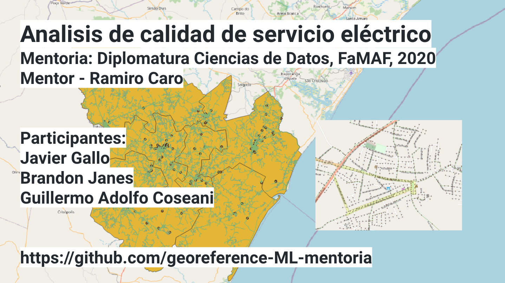
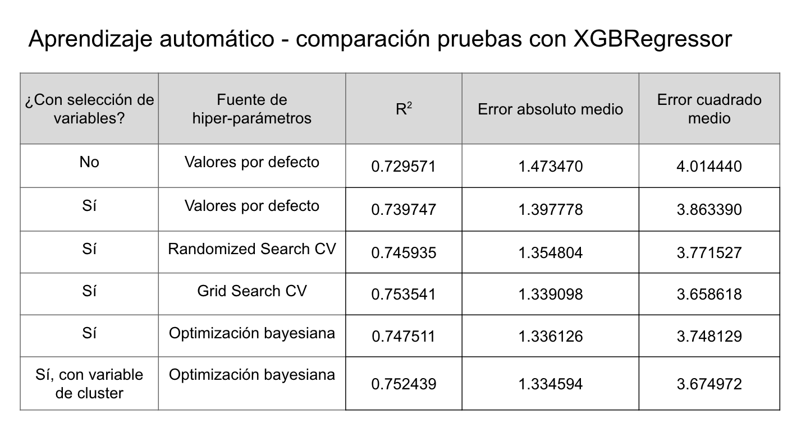

# Machine Learning Model - XGBoost Regressor

This repository outlines a machine learngin regression pipeline that predicts frequency of power failure and power outage duration using geographically referenced (GIS) customer and infrastructure data from ANEEL (National Agency of Electric Energy in Brazil); this process included engineering features, feature selection, and the use of supervised and unsupervised machine learning techniques.

### Description of the dataset

The dataset provided by contains the geographic database of ANEEL (National Agency of Electric Energy in Brazil) 2018. The dataset contains geographic data of the consumers and of all the assets of the distributor. One of the biggest challenges in this industry is knowing the drivers behind Service Quality that allow efficient decisions to be made on operating costs and investments. The objective of this project is to identify and apply different techniques of analysis / data processing to generate relevant information for decision-making.

### Results

